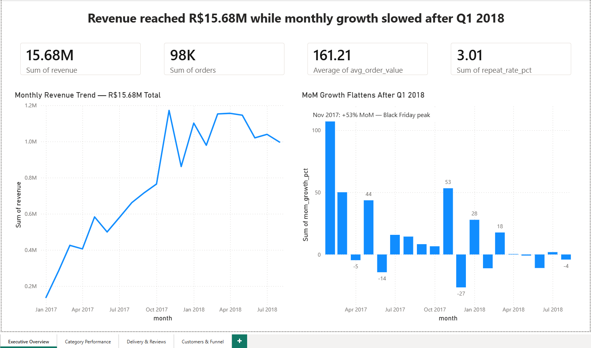
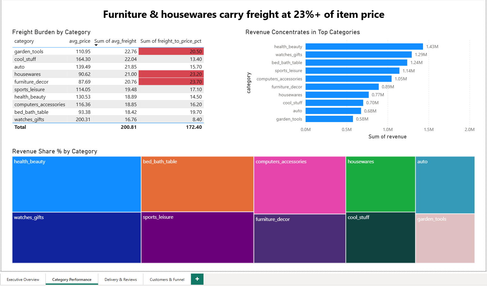
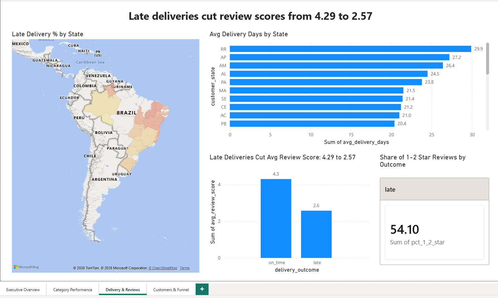
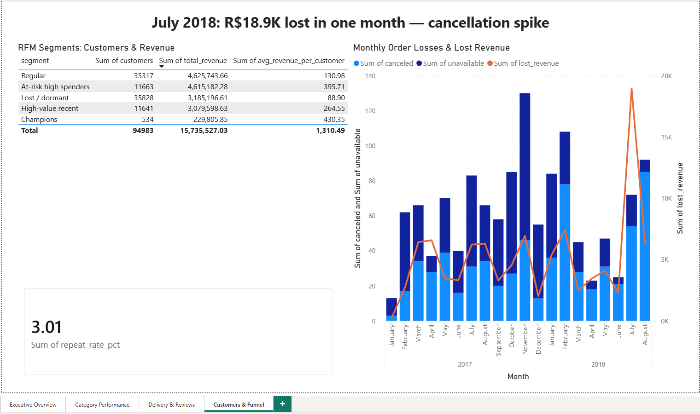

# Olist E-Commerce Analysis 📊

End-to-end business analysis of the **Olist Brazilian E-Commerce dataset** (100K+ orders, 2016–2018) using **PostgreSQL** for data cleaning and analysis and **Power BI** for dashboarding. The project identifies revenue trends, operational failures, and customer retention risks, and converts them into quantified business recommendations.

---

## 📌 Business Problem

Olist is a Brazilian marketplace connecting small sellers to customers across the country. Its growth depends on three levers: **order volume, customer satisfaction, and customer retention**. This analysis answers:

1. How is revenue trending, and where is growth stalling?
2. Which product categories drive revenue — and where are shipping economics broken?
3. Where do deliveries fail, and what does that cost in customer satisfaction?
4. How healthy is the customer base — do buyers come back?
5. How much revenue leaks out of the order funnel through cancellations?

---

## 🗂️ Dataset

**Source:** [Brazilian E-Commerce Public Dataset by Olist (Kaggle)](https://www.kaggle.com/datasets/olistbr/brazilian-ecommerce)

9 relational tables · 99,441 orders · Sep 2016 – Oct 2018:

| Table | Rows | Description |
|---|---|---|
| orders | 99,441 | Order lifecycle with timestamps |
| order_items | 112,650 | Line items with price and freight |
| customers | 99,441 | Customer IDs and location |
| order_payments | 103,886 | Payment method and value |
| order_reviews | 99,224 | Review scores and comments |
| products | 32,951 | Product attributes and category |
| sellers | 3,095 | Seller IDs and location |
| geolocation | 1,000,163 | Zip-code coordinates |
| product_category_translation | 71 | Portuguese → English category names |

*Raw CSVs are not included in this repo (size + licensing) — download from Kaggle link above.*

---

## 🛠️ Tools & Skills

- **PostgreSQL (pgAdmin)** — data import, cleaning, and all analysis in SQL: joins, CTEs, window functions (`ROW_NUMBER`, `LAG`, `NTILE`), aggregations, views
- **Power BI** — 4-page interactive dashboard, Power Query type transformations, DAX calculated column, conditional formatting, map visuals
- **GitHub** — documentation and version control

---

## 🧹 Data Quality Audit & Cleaning Decisions

A profiling pass surfaced real-world data issues, each handled with a documented decision (see `sql/02_data_cleaning.sql`):

| Issue found | Decision |
|---|---|
| 814 duplicate review IDs; 547 orders with multiple reviews | Kept only the **latest review per order** via `ROW_NUMBER()` |
| 8 orders marked *delivered* but missing delivery date | Flagged as corrupt, **excluded from delivery metrics** |
| 610 products (1.9%) with no category | Imputed as **"unknown"** rather than dropped, preserving their revenue |
| Partial months at dataset edges (2016 ramp-up, Sep–Oct 2018 tail) | Analysis window restricted to **complete months: Jan 2017 – Aug 2018** |
| 1,234 canceled/unavailable orders | Treated as a **separate funnel-loss segment**, not deleted |

---

## 🔍 Key Insights

**1. Revenue reached R$15.68M but growth plateaued.**
Monthly revenue grew from R$137K (Jan 2017) to a Black Friday peak of R$1.17M (Nov 2017, +53% MoM), then flattened around R$1.0–1.15M through mid-2018. Growth stalled while the platform kept acquiring customers — a scaling-efficiency warning.

**2. Late deliveries destroy customer satisfaction — the strongest pattern in the data.**
On-time orders average **4.29 stars**; late orders average **2.57**. **54.1% of late orders receive 1–2 stars** vs 9.2% for on-time. Delivery reliability is the single biggest satisfaction lever Olist controls.

**3. Delivery performance is deeply unequal by geography.**
Alagoas (AL): 24% of orders late, 24.5-day average delivery. São Paulo (SP): 5.9% late, 8.7 days. Northern/Northeastern states systematically miss the promised dates the platform itself sets.

**4. Only 3.01% of customers ever purchase again.**
Of 96,096 unique customers, just 2,888 returned. Growth is almost entirely acquisition-funded — the most expensive way to grow. The RFM segmentation shows **"At-risk high spenders" (11,663 customers) hold R$4.6M in historical revenue** — nearly equal to the 35K-customer "Regular" segment — making them the highest-ROI retention target.

**5. Freight economics are broken in furniture & home categories.**
furniture_decor and housewares carry freight at **23%+ of item price** (vs 8.4% for watches_gifts). High shipping-to-price ratios in these categories suppress conversion and reviews.

**6. Funnel leakage cost ~R$102K, with a July 2018 anomaly.**
Canceled + unavailable orders lost ~R$102K over 20 months. July 2018 alone lost **R$18.9K** — a cancellation spike worth operational investigation.

---

## 📈 Dashboard (Power BI, 4 pages)

### Page 1 — Executive Overview
KPIs (revenue, orders, AOV, repeat rate), monthly revenue trend, MoM growth.


### Page 2 — Category Performance
Top-10 categories by revenue, revenue share treemap, freight-to-price table with conditional formatting flagging broken shipping economics.


### Page 3 — Delivery & Reviews
Brazil map shaded by late-delivery %, delivery days by state, review-score impact of late delivery.


### Page 4 — Customers & Funnel
RFM segment table, repeat-rate KPI, monthly cancellations with lost-revenue trend line.


---

## 💡 Recommendations

1. **Fix delivery reliability in the Northeast first.** Recalibrate estimated delivery dates for AL/MA/PI (where 16–24% of orders arrive late) or invest in regional carrier partnerships. Every percentage point of late deliveries converted to on-time moves ~54% of those orders out of the 1–2 star zone.
2. **Launch a retention program aimed at "At-risk high spenders".** 11,663 customers holding R$4.6M in historical spend are drifting away; a win-back campaign here outperforms any equivalent acquisition spend given the 3% baseline repeat rate.
3. **Restructure freight pricing for furniture & housewares.** Freight at 23% of item price suppresses these categories; test freight subsidies, regional warehousing, or minimum-basket thresholds.
4. **Investigate the July 2018 cancellation spike** (R$18.9K lost in one month) for a root cause — seller failures, payment issues, or inventory sync problems.

---

## 📁 Repository Structure

```
olist-ecommerce-analysis/
├── sql/
│   ├── 01_create_tables.sql       # Schema for all 9 tables
│   ├── 02_data_cleaning.sql       # Cleaning views with documented decisions
│   └── 03_analysis_queries.sql    # 6 business analysis queries
├── results/                       # Query outputs (CSV)
├── dashboard/
│   ├── olist_analysis.pbix        # Power BI file
│   ├── olist_analysis.pdf         # Static export
│   └── screenshots/               # Dashboard page images
└── README.md
```

---

## 🔄 How to Reproduce

1. Download the dataset from [Kaggle](https://www.kaggle.com/datasets/olistbr/brazilian-ecommerce).
2. Create a PostgreSQL database and run `sql/01_create_tables.sql`.
3. Import each CSV into its table (pgAdmin Import/Export, format CSV, encoding UTF8, header ON).
4. Run `sql/02_data_cleaning.sql` to build the cleaning views.
5. Run the queries in `sql/03_analysis_queries.sql`; export results as CSV.
6. Open `dashboard/olist_analysis.pbix` in Power BI Desktop (or rebuild from the result CSVs).
